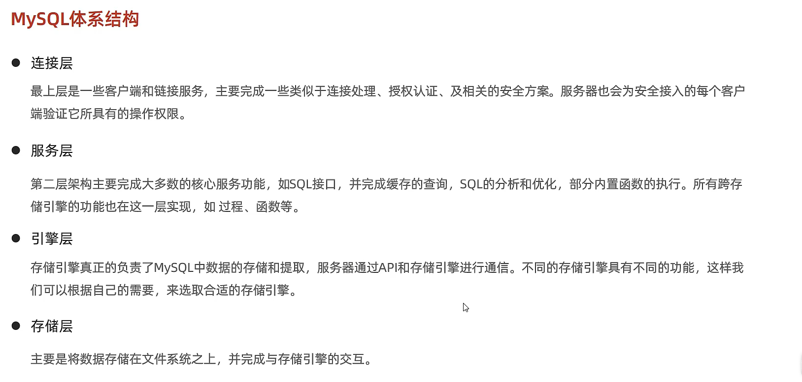

# [M946i.top](http://m946i.top)
# 
# 连接数据库
    mysql -h ip -P port -u user -p
    
    password
## DDL

    show databases; -- 显示所有数据库
    
    select database(); -- 查询当前数据库
    
    create database [if not exists] 数据库名 [default charset 字符集] [collate 排序规则]; -- 创建数据库
    
    drop database [if exist]; -- 删除数据库
    
    use 数据库名; -- 使用数据库
    
    show tables; -- 查询当前数据库所有表
    
    desc 表名; -- 查询表结构
    
    show create table 表名; -- 查询指定表建表语句
    
    create table 表名(
    
        column_name column_type
    
        -- id int unsigned not null comment '编号'
    
    ); 
    -- 创建表
    
    alter table 表名 add 字段名 类型(长度) [comment 注释] [约束]; -- 添加字段
    
    alter table 表名 modify 字段名 新数据类型(长度); -- 修改字段数据类型
    
    alter table change 旧字段名 新字段名 类型(长度) [comment 注释] [约束]; -- 修改字段名及字段数据类型
    
    alter table drop 字段名; -- 删除字段
    
    alter table 表名 rename to 新表名; -- 修改表名
    
    drop table [if exist] 表名; -- 删除表
    
    truncate table 表名; -- 删除并重建表

## DML

    insert into 表名(字段1,字段2,....) values(值1,值2,...); -- 指定字段添加数据
    
    insert into 表名 values(值1,值2,...); -- 给全部字段添加数据
    
    insert into 表名(字段1,字段2,....) values(值1,值2,...),(值1,值2,...),...(值1,值2,...),(值1,值2,...); -- 批量添加指定字段数据
    
    insert into 表名 values(值1,值2,...),(值1,值2,...),...(值1,值2,...),(值1,值2,...); -- 批量添加全部字段数据
    
    update 表名 set 字段1=值1,字段2=值2,...[where 条件]; -- 更新字段数据类型
    
    delete from 表名 [where 条件]; -- 删除数据


## DQL


    select distinct 字段 from 表名 where 条件列表 group by 分组字段列表 having 分组后条件列表 order by 排序字段列表 desc/asc  limit 分页参数;//条件查询
    
    select 字段1,字段2,字段3...from 表名; -- 查询多个字段
    
    select * from 表名;// 
    
    select 字段1 [as 别名1],字段2 [别名2],... from 表名; -- 设置别名
    
    select  distinct 字段列表 from 表名; -- 查询 去重
    
    select 字段列表 from 表名 where 条件列表; -- 条件 ( >  >=  <  <=  =  (<>  !=)  between...(小)and...(大)  in(...)(多选一)    like    is null  (and &&) (or ||)  (not !) )

聚合函数 
    
    count sum min max avg
    
    select count/sum/min/max/avg(字段名) from 表名 ...

执行顺序    
    
    from-where-group by-having-select-order by-limit


## DCL


    use mysql; -- 使用mysql数据库
    
    select * from user; -- 查询用户
    
    create user '用户名'@'主机名' identified by '密码'; -- 创建用户
    
    alter user '用户名'@'主机名' identified with mysql_native_password by '新密码'; -- 更改用户密码
    
    drop user '用户名'@'主机名'; -- 删除用户


    show grants for '用户名'@'主机名'; -- 查询权限
    
    grant 权限名 on 数据库.表名 to '用户名'@'主机名'; -- 授权
    
    revoke 权限名 on 数据库.表名 from '用户名'@'主机名'; -- 撤销权限
    
    concat(S1,S2,...Sn)  -- 字符串拼接，将s1，s2，...sn拼接成一个字符
    
    lower(str)  -- 小写
    
    upper(str)  -- 大写
    
    lpad(str,n,pad)  -- 左填充pad
    
    rpad(str,n,pad)  -- 右填充pad
    
    trim(str)  -- 去除头部尾部空格
    
    substring(str,start,len)  -- start->start+len字符串截取
    
    ceil(x) -- 向上取整
    
    floor(x)  -- 向下取整
    
    mod(x,y)  -- x/y的余数
    
    rand() -- 返回(0,1)之间的随机数
    
    round(x,y)  -- 求x四舍五入的值，保留y位小数


    curdate() -- 返回当前日期
    
    curtime() -- 返回当前时间
    
    now() -- 返回当前时间日期
    
    year(date)  -- 获取日期中的年
    
    month(date)  -- 获取日期中的月
    
    day(date)   -- 获取日期中的日
    
    date_add(date,interval expr type)
    
    datediff(date1,date2) //返回date1到date2的天数
    
    if(value,t,f)  //value为true 返回 t 否则返回 f
    
    ifnull(value1,value2) //value1为不为空 返回value1 否则 返回value2
    
    case when [var1] then [res1]...else [default] end  -- var1为true 返回res1 否则 返回default默认值(固定值)
    
    select case when id = 1 then 1 else 2 end;
    
    case [expr] when [var1] then [res1] ... else [default] end -- 非固定
    
    select case id when 1 then 1 else 2 end;


## 约束

    非空约束 not null
    
    唯一约束 unique
    
    主键约束 primary key
    
    默认约束 default [默认为1]
    
    检查约束 check
    
    外键约束 foreign key
## 多表关系
    一对多：在多的一方设置外键，关联一的一方的主键
    
    多对多：建立中间表，中间表包含两个外键，关联两张表的主键
    
    一对一：用于表结构拆分，在其中任何一方设置外键（UNIQUE），关联另一方的主键

##  多表查询

## 内连接 [交集部分]

隐式内连接 

    select 字段列表 from 表1,表2 where 条件...;

显示内连接

    select 字段列表 from 表1 [inner] join 表2 on 条件列表...;  
    -- [inner]可省略

## 外连接 

左外连接

    select 字段名称 from 表1 left [outer] join 表2 on 条件...;  
    -- [outer] 可省略

右外连接

    select 字段名称 from 表1 right [outer] join 表2 on 条件...;  
    -- [outer] 可省略

## 自连接

    select 字段名称 from 表A 别名A join 表A 别名B on 条件...;
    -- 自连接查询，可以是内连接查询，也可以是外连接查询。

## 联合查询

    select 字段名称 from 表A ...
    
        union [ALL]
    
    select 字段名称 from 表B ...; 
    -- 上下合并 查询字段的数量和类型必须相同 union ALL直接合并 union 去重

## 子查询 [嵌套查询]

    select * from 表1 where column1 = (select column1 from 表2);
    -- 子查询外部语句可以是insert/update/delete/select的任何一个。
### 根据子查询结果不同，分为:
    标量子查询（子查询结果为单个值）
    
    列子查询（子查询结果为一列）
    
    行子查询（子查询结果为一行）
    
    表子查询（子查询结果为多行多列）

### 标量子查询 
    =、<>、>、>=、<、<=
### 列子查询
    IN -- 在指定的集合范围内，多选一
    
    NOT IN -- 不在指定的集合范围之内
    
    ANY -- 子查询返回列表中，有任意一个满足即可
    
    SOME -- 与ANY等同，使用SOME的地方可以使用ANY
    
    ALL -- 子查询返回列表的所有值都必须满足
### 行子查询
    =、<>、IN、NOT IN 
### 表子查询
    IN
## 事务
###
#### 事务 是一组操作的集合，它是一个不可分割的工作单位，事务会吧所有的操作作为一个整体一起想系统提交或撤销操作请求，即这些操作要么同时成功，要么同时失败。
###
### 事务操作
    select @@autocommit;
    
    set @@autocommit = 0;
    
    -- 查看/设置事务提交方式
    
    commit;
    
    -- 提交事务
    
    rollback;
    
    -- 回滚事务
### 事务四大特性
    原子性:事务是不可分割的最小操作单元，要么全部成功，要么全部失败。
    一致性:事务完成时，必须使所有的数据都保持一致的状态。
    隔离性:数据库系统提供隔离机制，保证事务在不受外部并发操作影响的独立环境下运行。
    持久性:事务一旦提交或回滚，它对数据库中的数据的改变就是永久的。
### 并发事务问题
    脏读:一个事务读到另一个事务还没有提交的数据。
    不可重复读:一个事务先后读取同一条记录，但两次读取的数据不同，称之为不可重复读。
    幻读:一个事务按照条件查询数据时，没有对应的数据行，但是在插入数据时，又发现这行数据已经存在，好像出现了”幻影“。
### 事务隔离级别
 
    
    -- 查看事务隔离级别
    
    select @@transaction_isolation;
    
    -- 设置事务隔离级别
    
    set [session|global] transaction isolaction level {read uncommitted | read committed | repe}atable read | serializable}


## 存储引擎


## 存储引擎简介

### 在创建表时，指定存储引擎

    create table 表名
    (
    
        字段1 字段1类型 [comment 字段1注释],
        
        ......
        
        字段n 字段n类型 [comment 字段n注释]
    
    )engine = innodb [comment 表注释]

### 查看当前数据库支持的存储引擎

    show engines;

## 存储引擎特点

### InnoDB

介绍

    InnoDB是一种兼顾高可靠性和高性能的通用存储引擎，在MySQL5.5之后，InnoDB是默认的MySQL存储引擎。

特点

    DML操作遵循ACID模型，支持事务;
    行级锁，提高并发访问性能;
    支持外键FOREIGNKEY约束，保证数据的完整性和正确性;

文件

    xxx.ibd:xxx代表的是表名，innoDB引擎的每一张表都会对应这样一个空间文件，存储该表的表结构（frm、sdi）、数据和索引。
    参数：innodb_file_per_table
    
    show variables like 'innodb_file_per_table';

    -- 区:1M-64页-页:16k

### MyISAM

介绍

    MyISAM是MySQL早期的默认存储引擎。

特点

    不支持事务，不支持外键
    支持表锁，不支持行锁
    访问速度快

文件

    xxx.sdi: 存储表结构信息
    xxx.MYD: 存储数据
    xxx.MYI: 存储索引

###  Memory

介绍

    Memory引擎的表数据时存储再内存中的，由于收到硬件影响、或断电问题的影响，只能将这些表作为临时表或缓存表使用。

特点

    内存存放
    hash索引(默认)

文件

    xxx.sdi: 存储表结构信息


## 存储引擎选择

### 在选择存储引擎时，应该根据应用系统的特点选择合适的存储引擎。对于复杂的应用系统，还可以根据实际情况选择多种存储引擎进行组合。

    InnoDB: 是MySQL的默认存储引擎，支持事务、外键。如果是应用对事物的完整性有比较高的要求，再并发条件下要求数据一致性，数据操作除了插入和查询之外，还包含很多的更新、删除操作，那么InnoDB存储引擎是比较合适的选择。
    
    MyISAM: 如果应用是以读操作和插入操作为主，只有很少的更新和删除操作，并且事务的完整性、并发性要求不是很高，那么选择这个存储引擎是非常合适的。
    
    MEMORY: 将所用数据保存再内存中，访问速度快，通常用于临时表及缓存。MEMORY的缺陷就是对表的大小有限制，太大的表无法缓存在内存中，而且无法保证数据的安全性。

## MySQL安装(linux版)

    密码等级
    
    政策             执行的测试
    
    0或者LOW         长度
    
    1或者MEDIUM      长度；数字、小写/大写和特殊字符
    
    2或者STRONG      长度；数字、小写/大写和特殊字符；字典文件
       
    设置密码等级
    
    set global validate_password.policy = 0;
    
    设置密码长度
    
    set global validate_password.length = 4;

## 索引

### 索引概述

```text
介绍

索引（index）是帮助MySQL高效获取数据的数据结构（有序）。在数据之外，数据库系统还维护着满足特定查找算法的数据结构，这些数据结构以某种方式引用（指向）数据，这样就可以在这些数据结构上实现高级查找算法，这种数据结构就是索引。
```

### 演示


##### 优缺点

|                            优势                             |                             劣势                             |
| :---------------------------------------------------------: | :----------------------------------------------------------: |
|           提高数据检索的效率，降低数据库的IO成本            |                    索引列也是要占用空间的                    |
| 通过索引列对数据进行排序，降低数据排序的成本，降低CPU的消耗 | 索引大大提高了查询效率，同时却也降低更新表的速度，如对表进行INSERT、UPDATE、DELETE时，效率降低。 |

### 索引结构

MySQL的索引是在存储引擎层实现的，不同的存储引擎有不同的结构，包含以下几种：

|       索引结构        |                             描述                             |
| :-------------------: | :----------------------------------------------------------: |
|      B+Tree索引       |            最常见的索引类型，大部分都支持B+树索引            |
|       Hash索引        | 底层数据结构是用哈希表实现的，只有精确匹配索引列的查询才有效，不支持范围查询 |
|  R-Tree（空间索引）   | 空间索引是MyISAM引擎的一个特殊索引类型，主要用于地理数据类型，通常使用较少 |
| Full-text（全文索引） | 是一种通过建立倒排序索引，快速匹配文档的方式。类似于Lucene，Solr，ES |

- B-Tree（**多路**平衡查找树）

  以一颗最大度数（max-degree）为5（5阶）的b-tree为例（每个节点最多存储4个key，5个指针）：[B树](https://www.cs.usfca.edu/~galles/visualization/BTree.html)

- B+Tree

  以一颗最大度数（max-degree）为4（4阶）的b+tree为例：[B+树](https://www.cs.usfca.edu/~galles/visualization/BPlusTree.html)

  相对于B-Tree区别：

  - 所有的数据都会出现在叶子节点

  - 叶子节点形成一个单向链表
  - MySQL索引数据结构对经典的B+Tree进行优化。在原B+Tree的基础上，增加一个指向相邻叶子节点的链表指针，就形成了带有顺序指针的B+Tree，提高区间访问的性能。

- Hash

  哈希表索引就是采用一定的hash算法，将键值换算成新的hash值，映射到对应的槽位上，然后存储在hash表中。

  如果两个（或多个）键值，映射到一个相同的槽位上，他们就产生了hash冲突（也称hash碰撞），可以通过链表来解决。

  Hash索引的特点

  1. Hash索引只能用于对等比较（=，in)，不支持范围查询（between, >, <, ...）
  2. 无法利用索引完成排序操作
  3. 查询效率高，通常只需要一次检索就可以了，效率通常要高于B+tree索引

  存储引擎支持

  在MySQL中，支持hash索引的是Memory引擎，而InnoDB中具有自适应hash功能，hash索引是存储引擎根据B+Tree索引在指定条件下自动构建的。

### 索引分类

|   分类   |                         含义                         |           特点           |  关键字  |
| :------: | :--------------------------------------------------: | :----------------------: | :------: |
| 主键索引 |               针对于表中主键创建的索引               | 默认自动创建，只能有一个 | PRIMARY  |
| 唯一索引 |           避免同一个表中某数据列中的值重复           |        可以有多个        |  UNIQUE  |
| 常规索引 |                   快速定位特定数据                   |        可以有多个        |          |
| 全文索引 | 全文索引查找的是文本中的关键字，而不是比较索引中的值 |        可以有多个        | FULLTEXT |

在InnoDB存储引擎中，根据索引的存储形式，又可以分为以下两种：

|            分类             |                            含义                            |         特点         |
| :-------------------------: | :--------------------------------------------------------: | :------------------: |
| 聚集索引（Clustered Index） | 将数据存储与索引放到了一块，索引结构的叶子节点保存了行数据 | 必须有，而且只有一个 |
| 二级索引（Secondary Index） | 将数据与索引分开存储，索引结构的叶子节点关联的是对应的主键 |     可以存在多个     |

聚集索引选取规则：

- 如果存在主键，主键索引就是聚集索引。
- 如果不存在主键，将使用第一个唯一索引（UNIQUE）索引作为聚集索引。
- 如果表没有主键，或没有合适的唯一索引，则InnoDB会自动生成一个rowid作为隐藏的聚集索引。

### 索引语法

- 创建索引

  ```mysql
  CREATE [UNIQUE|FULLTEXT] INDEX index_name ON table_name (index_col_name,...);
  ```

- 查看索引

  ```mysql
  SHOW INDEX FROM table_name;
  ```

- 删除索引

  ```mysql
  DROP INDEX index_name ON table_name;
  ```

### SQL性能分析

- SQL执行频率

  MySQL客户端连接成功后，通过show [session|global] status命令可以提供服务器 状态信息。通过如下指令，可以查看当前数据库的INSERT、UPDATE、DELETE、SELECT的访问频次：

  ```mysql
  SHOW GLOBAL STATUS LIKE 'Com_______';
  ```

- 慢查询日志

  慢查询日志记录了所有执行时间超过指定参数（long_query_time,单位：秒，默认10秒）的所有SQL语句的日志。

  MySQL的慢查询日志默认没有开启，需要在MySQL的配置文件（/etc/my.conf）中配置如下信息：

  ```config
  #开启MySQL慢日志开关
  show_query_log=1
  #设置慢日志的时间为2秒，SQL语句执行时间超过2秒，就会视为慢查询，记录慢查询日志
  long_query_time=2
  ```

  配置完毕之后，通过以下指令重启MySQL服务器进行测试，查看慢日志文件中记录的信息/var/lib/mysql/localhost-show.log。

- profile详情

  show profile能够在做SQL优化时帮助我们了解时间都耗费到哪里去了。通过have_profiling参数，能够看到当前MySQL是否支持profile操作：

  ```mysql
  SELECT @@have_profiling;
  ```

  默认profile是关闭的，可以通过set语句在session/global级别开启profiling：

  ```mysql
  SET profiling=1;
  ```

  执行一系列的业务SQL操作，然后通过如下指令查看指令的执行耗时：

  ```mysql
  #查看每一条SQL的耗时基本情况
  show prifiles;
  
  #查看指定query_id的SQL语句各个阶段的耗时情况
  show profile for query query_id;
  
  #查看指定query_id的SQL语句CPU的使用情况
  show profile cpu for query query_id;
  ```

- explain执行计划

  EXPLAIN或者DESC命令获取MySQL如何执行SELECT语句的信息，包括在SELECT语句执行过程中表如何连接和连接的顺序。

  语法：

  ```mysql
  # 直接在select语句之前加上关键字explain/desc
  EXPLAIN SELECT 字段列表 FROM 表明 WHERE 条件;
  ```

  EXPLAIN执行计划各字段的含义：

  - id

    select 查询的序号，表示查询中执行select子句或者是操作表的顺序（id相同，执行顺序从上到下；id不同，值越大，越先执行）。

  - select_type

    表示SELECT的类型，常见的取值有SIMPLE（简单表，即不使用表连接或者子查询）、PRIMARY（主查询，即外层的查询）、UNION（UNION中的第二个或者后面的查询语句）、SUBQUERY（SELECT/WHERE之后包含了子查询）等

  - type

    表示连接类型，性能由好到差的连接类型为NULL、system、const、eq_ref、ref、range、index、all。

  - possible_key

    显示可能应用在这张表的索引，一个或多个。

  - Key

    实际使用的索引，如果为NULL，则没有使用索引。

  - Key_len

    表示索引中使用的字节数，该值为索引字段最大可能长度，并非实际使用长度，在不损失精确性的前提下，长度越短越好。

  - rows

    MySQL认为必须要执行查询的行数，在InnoDB引擎中的表中，是一个估计值，可能并不总是准确的。

  - filtered

    查询返回结果的行数占读取行数的百分比，filtered的值越大越好。

### 索引使用

- 验证索引效率

  在未建立索引之前，执行如下SQL语句，查看SQL的耗时。

  ```mysql
  SELECT * FROM tb_sku WHERE sn='10000003145001';
  ```

  针对字段创建索引

  ```mysql
  create index idx_sn on tb_sku(sn);
  ```

  然后再次执行相同的SQL语句，再次查看SQL的耗时。

  ```mysql
  SELECT * FROM tb_sku WHERE sn='10000003145001';
  ```

- 最左前缀法则

  如果索引了多列（联合索引），要遵守最左前缀法则。最左前缀法则指的是查询从索引的 最左列开始，并且不跳过索引中的列。

  如果跳跃某一列，**索引将部分失效（后面的字段索引失效）**

- 范围查询

  联合索引中，出现范围查询(>,<)，**范围查询右侧的列索引失效**

- 索引列运算

  不要在索引列上进行运算操作，**索引将失效**。

- 字符串不加引号

  字符串类型字段使用时，不加引号，**索引将失效**。

- 模糊查询

  如果仅仅是尾部模糊匹配，索引不会失效。如果是头部模糊匹配，索引失效。

- or连接的条件

  用or分割开的条件，如果or前的条件中的所有列有索引，而后面的列中没有索引，那么涉及的索引都不会被用到。

- 数据分布影响

  如果MySQL评估使用索引比全表更慢，则不使用索引。

- SQL提示

  SQL提示，是优化数据库的一个重要手段，简单来说，就是在SQL语句中加入一些人为的提示来达到优化操作的目的。

  use index:

  ```mysql
  explain select * from table_name use index(index_name) where <条件>;
  ```

  ignore index:

  ```mysql
  explain select * from table_name ignore index(index_name) where <条件>;
  ```

  force index:

  ```mysql
  explain select * from table_name force index(index_name) where <条件>;
  ```

- 覆盖索引

  尽量使用覆盖索引（查询使用了索引，并且需要返回的列，在该索引中已经全部能够找到），减少select *。
  ```tex
  using index condition : 查找使用了索引，但是需要回表查询
  using where;using index : 查找使用了索引，但是需要的数据都在索引列中能找到，所以不需要回表查询数据
  ```
  
  
  
  
  
  

- 前缀索引

  当字段类型为字符串（varchar，text等）时，有时候需要索引很长的字符串，这会让索引变得很大，查询时，浪费大量的磁盘IO，影响查询。此时可以只将字符串的一部分前缀，建立索引，这样可以大大节约索引空间，从而提高索引效率。

  ```mysql
  # 语法
  create index idx_xxxx on table_name(column(n));
  # n为字符数
  ```
  
  前缀长度
  
  可以根据索引的选择性来决定，而选择性是指不重复的索引值，索引选择性越高则查询效率越高，唯一索引的选择性是1，这是最好的索引选择性，性能也是最好的。
  
  ```mysql
  select count(distinct email)/count(*) from tb_user;
  select count(distinct substring(email,1,5))/count(*) from tb_user;
  ```
  
  

- 单列索引与联合索引

  单列索引：即一个索引只包含单个列。

  联合索引：即一个索引包含了多个列。

  在业务场景中，如果存在多个查询条件，考虑针对于查询字段建立索引时，建议建立联合索引，而非单例索引。

  **多条件联合查询时，MySQL优化器会评估哪个字段的索引效率更高，会选择该索引完成本次查询。**

### 索引设计原则

1. 针对数据量较大，且查询比较频繁的表建立索引。
2. 针对于常作为查询条件（where）、排序（order by）、分组（group by）操作的字段建立索引。
3. 尽量选择区分度高的列作为索引，尽量建立唯一索引，区分度越高，使用索引的效率越高，使用索引的效率越高。
4. 如果是字符串类型的字段，字段的长度较长，可以针对于字段的特点，建立前缀索引。
5. 尽量使用联合索引，减少单列索引，查询时，联合索引很多时候可以覆盖索引，节省存储空间，避免回表，提高查询效率。
6. 要控制索引的数量，索引并不是多多益善，索引越多，维护索引结构的代价就越大，会影响增删改的效率。
7. 如果索引列不能存储NULL值，请在创建表时使用NOT NULL约束它。当优化器知道每列是否包含NULL值时，它可以更好地确定哪个索引最有效地用于查询。

### SQL优化

- insert优化

  批量插入

  ```mysql
  insert into tb_test values(1,'Tom'),(2,'Cat'),(3,'Jerry');
  ```

  手动提交事务

  ```mysql
  start transaction;
  insert into tb_test values(1,'Tom'),(2,'Cat'),(3,'Jerry');
  insert into tb_test values(4,'Tom'),(5,'Cat'),(6,'Jerry');
  insert into tb_test values(7,'Tom'),(8,'Cat'),(9,'Jerry');
  commit;
  ```

  主键顺序插入

  ```tex
  主键乱序插入：8 1 9 21 88 2 4 15 89 5 7 3
  主键顺序插入：1 2 3 4 5 7 8 9 15 21 88 89
  ```

- 大批量插入数据

  如果一次性需要插入大批量数据，使用insert语句性能较低，此时可以使用MySQL数据库提供的load指令进行插入。操作如下：

  ```mysql
  #客户端连接服务端时，加上参数 --local-infile
  mysql --local-infile -u root -p
  #设置全局参数local_infile为1，开启从本地加载文件导入数据的开关
  set global local_infile=1;
  #执行load指令将准备好的数据，加载到表结构中
  load data local infile '/root/sql1.log' into 'tb_user' fields terminated by ',' lines terminated by '\n';
  ```

  主键顺序插入性能高于乱序插入

- 主键优化

  - 数据组织方式

    在InnoDB存储引擎中，表数据都是根据主键顺序组织存放的，这种存储方式的表称为**索引组织表**（index organization table **IOT**）。

  - 页分裂

    页可以为空，也可以填充一半，也可以填充100%。每个页包含了2-N行数据（如果一行数据多大，会行溢出），根据主键排序。

  - 页合并

    当删除一行记录时，实际上记录并没有被物理删除，只是记录被标记（flaged）为删除并且它的空间变得允许被其他记录声明使用。

    当页中删除的记录达到MERGE_THRESHOLD（默认为页的50%），InnoDB会开始寻找最靠近的页（前或后）看看是否将两个页合并以优化使用。

    MERGRE_THRESHOLD：合并页的阈值，可以自己设置，在创建表或者创建索引时指定。

  - 主键设计原则

    满足业务需求的情况下，尽量降低主键的长度。

    插入数据时，尽量选择顺序插入，选择使用AUTO_INCREMENT自增主键。.

    尽量不要使用UUID做主键或者是其他自然主键，如身份证号。

    业务操作时，避免对主键的修改。

- order by优化

  1. Using filesort：通常表的索引或全表扫描，满足条件的数据行，然后在排序缓冲区sort buffer中完成排序操作，所有不是通过索引直接返回排序结果的排序都叫FileSort排序。
  2. Using index：通常有序索引顺序扫描直接返回有序数据，这种情况即为using index，不需要额外排序，操作效率高。

  ```mysql
  #没有创建索引时，根据age，phone进行排序
  explain select id,age,phone from tb_user order by age,phone;
  #创建索引
  create index idx_user_age_phone_aa on tb_user(age,phone);
  #创建索引后，根据age,phone进行升序排序
  explain select id,age,phone from tb_user order by age,phone;
  #创建索引后，根据age，phone进行降序排序
  explain select id,age,phone from tb_user order by age desc,phone desc;
  ```

  根据排序字段建立合适的索引，多字段排序时，也遵循最左前缀法则。

  尽量使用覆盖索引。

  多字段排序，一个升序一个降序，此时需要注意联合索引在创建时的规则（ASC/DESC）。

  如果不可避免的出现filesort，大数据量排序时，可以适当增大排序缓冲区大小sort_buffer_size（默认256k）。

- group by优化

  ```mysql
  #删除掉目前的联合索引 idx_user_pro_sta
  drop index idx_user_pro_sta on tb_user;
  #执行分组操作，根据profession字段分组
  explain select profession,count(*) from tb_user group by profession;
  #创建索引
  Create index idx_user_pro_age_sta on tb_user(profession,age,status);
  #执行分组操作，根据profession字段分组
  explain select profession,count(*) from tb_user group by profession;
  #执行分组操作，根据profession字段分组
  explain select profession,count(*) from tb_user group by profession,age;
  ```

  在分组操作时，可以通过索引来提高效率。

  分组操作时，索引的使用也是满足最左前缀法则的。

- limit优化

  一个常见有非常头疼的问题就是limit 20000000,10，此时需要MySQL排序前2000010记录，仅仅返回2000000-2000010的记录，其他记录丢弃，查询排序的代价非常大。

  优化思路：一般分页查询时，通过创建 覆盖索引 能够此较好地提高性能，可以通过覆盖索引加子查询形式进行优化。

  ```mysql
  explain select * from tb_sku t,(select id from tb_sku order by id limit 2000000,10) a where t.id = a.id;
  ```

- count优化

  ```mysql
  explain select count(*) from tb_user;
  ```

  MyISAM引擎把一个表的总行数存在了磁盘上，因为执行count(*)的时候会直接返回这个数，效率很高；

  InnoDB引擎就麻烦了，它执行count(*)的时候，需要把数据一行一行地从索引里面读出来，然后累积计数。

  优化思路：自己计数。

  - count的几种方法

    count()是一个聚合函数，对于返回的结果集，一行一行地判断，如果count函数的参数不是NULL，累计值就加1，否则不加，最后返回累加值。

    用法：count(*) 、count(主键)、count(字段)、count(1)

    count(主键)

    InnoDB引擎会遍历整张表，把每一行的主键id值取出来，返回给服务层。服务层拿到主键后，直接按行累加(主键不可能为null)。

    count(字段)

    没有not null约束：InnoDB引擎会遍历整张表把每一行的字段值都取出来，返回给服务层，服务层判断是否为null，不为null，计数累加。

    有not null约束：InnoDB引擎会遍历整张表把每一行的字段值都取出来，返回给服务层，直接按行进行累加。

    count(1)

    InnoDB引擎便利整张表，但不取值。服务层对于返回的每一行，放一个数字“1”进去，直接按行进行累加。

    count(*)

    InnoDB引擎并不会把全部字段取出来，而是专门做优化，不取值，服务层直接按行进行累加。

  按照效率排序的话，count(字段)<count(主键id)<count(1)=count(*),所以尽量使用count(*)。

- update优化

  ```mysql
  update table_name set column1=value1 where column2=value2;
  ```

  ```
  update table_name set column1=value1 where column3=value3;
  ```

  InnoDB的行锁是针对索引加的锁，不是针对记录加的锁，并且该索引不能失效，否则会从行锁升级为表锁。

### 视图

- 介绍

  视图（View）是一种虚拟存在的表。视图中的数据并不在数据库中实际存在，行和列数据来自定义视图的查询使用的表，并且是在使用视图动态生成的。

  通俗的讲，视图只保存了查询的SQL逻辑，不保存查询的结果。所以我们创建视图的时候，主要的工作就落在创建这条SQL查询语句上。

- 创建

  ```mysql
  CREATE [OR REPLACE] VIEW 视图名称[(列名列表)] AS SELECT语句 [WITH[CASCADED|LOCAL] CHECK OPTION]
  ```

- 查询

  ```mysql
  #查看创建视图语句：
  SHOW CREATE VIEW 视图名称;
  #查看视图数据：
  SELECT * from 视图名称......;
  ```

- 修改

  ```mysql
  CREATE [OR REPLACE] VIEW 视图名称[(列名列表)] AS SELECT语句 [WITH(CASCADED|LOCAL) CHECK OPTION]
  
  ATER VIEW 视图名称[(列名列表)] AS SELECT语句 [WITH[CASCADED|LOCAL] CHECK OPTION]
  ```

- 删除

  ```mysql
  DROP VIEW [IF EXISTS] [视图名称]...
  ```

- 视图的检查选项

  当使用WITH CHECK OPTION子句创建视图时，MySQL会通过视图检查正在更改的每个行，例如插入，更新，删除，以使其符合视图的定义。MySQL允许基于另一个视图创建视图，它还会检查依赖视图中的规则以保持一致性。为了确定检查的范围，mysql提供了两个选项：CASCADED和LOCAL，默认值为CASCADED。

  CASCADED：

  ```mysql
  create view v1 as select id,name from student where id<=20 <with cascaded check option>;
  ```
  ​																				:arrow_up:
  
  ```mysql
  create view v2 as select id,name from v1 where id>=10 with cascaded check option;
  ```
  
  ​																				:arrow_up:
  
  ```mysql
  create view v3 as select id,name from v2 where id<=15;
  ```
  
  LOCAL：
  
  ```mysql
  create view v1 as select id,name from student where id <= 15;
  ```
  
  ​																				:arrow_up:
  
  ```mysql
  create view v2 as select id,name from v1 where id >= 10 [with local check option];
  ```
  
  
  
  ```mysql
  create view v3 as select id,name from v2 where id < 20
  ```

- 视图的更新

  要使视图可更新，视图中的行与基础表中的行之间必须存在一对一的关系。如果视图包含以下任何一项，则该视图不可更新：

  1. 聚合函数或窗口函数(SUM()、MIN()、MAX()、COUNT()等)
  2. DISTINCT
  3. GROUP BY
  4. HAVING
  5. UNION或者UNION ALL

- 作用

  简单

  视图不仅可以简化用户对数据的理解，也可以简化他们的操作。那些被经常使用的查询可以被定义为视图，从而使得用户不必为以后的操作每次指定全部的条件。

  安全

  数据库可以授权，但不能授权到数据库特定行和特定的列上。通过视图用户只能 查询和修改他们所能见到的数据。

  数据独立

  视图可帮助用户屏蔽真实表结构变化带来的影响。
